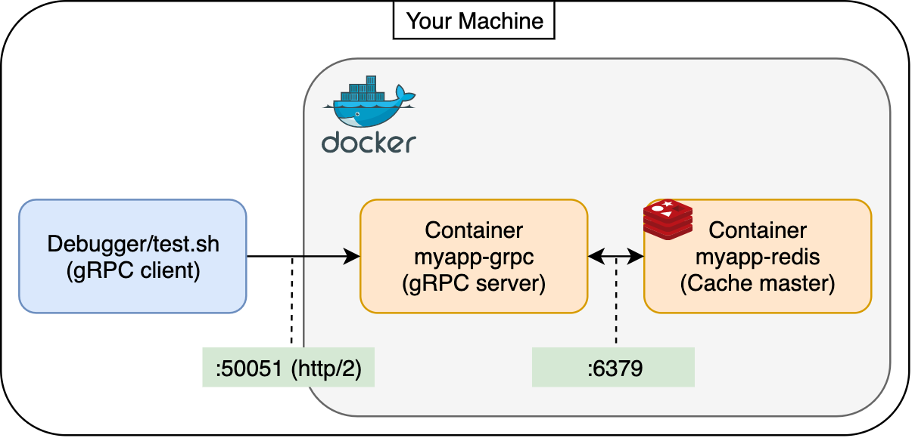

# grpc-redis

This is an example of a python-based gRPC server with a redis cache.

## Diagram



## Development

Run your docker containers

```
$ docker-compose up --build

Attaching to myapp-redis, myapp-grpc
myapp-redis    | Redis is starting oO0OoO0OoO0Oo
....
myapp-grpc     | started listening on 50051...
```

### Development locally

- (Prerequisite) Setup python virtualenv

```
$ brew install protobuf  // MacOS
$ python3 -m venv py3
```

- Run server without docker

For local development, you need to generate `pb2 related files` by following command

```
$ ./py3/bin/python3 -m grpc_tools.protoc --python_out=./myapp --grpc_python_out=./myapp --proto_path ./myapp/proto ./myapp/proto/*.proto
$ ./py3/bin/python3 -i myapp/src/app.py
>>> main()  # this works, but the query will fail by client query due to no redis setup
```

- Test your gRPC service by python client

```
$ cd Debugger
$ sh test.sh
Echo client received: You said: Hello World!
```

### Other handy commands

- Cleanup: `docker rm $(docker ps -a -q)`
- Force rebuild: `docker-compose build --no-cache; docker-compose up -d --force-recreate`

## Notes

1. In this example, we use docker to build our own simple redis service for convenience. In production, you should consider creating the redis service under cloud service provider (i.e. AWS Elasticache) with primary endpoints and multiple read only replicas.
2. Docker hides the `pb2` file generation in `setup.py`. (But in `Debugger/test.sh`, it requires to build them.)

## Reference

- [Implementing gRPC server using Python](https://towardsdatascience.com/implementing-grpc-server-using-python-9dc42e8daea0#ecbf)
